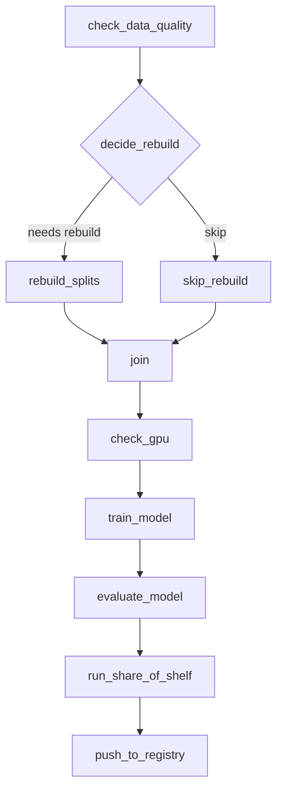
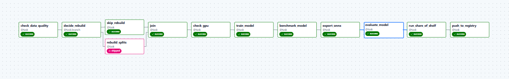
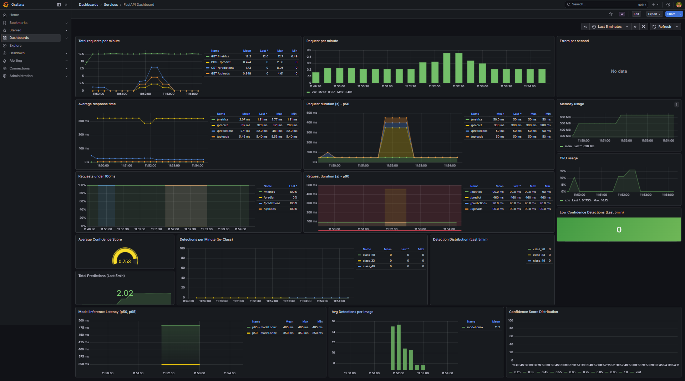
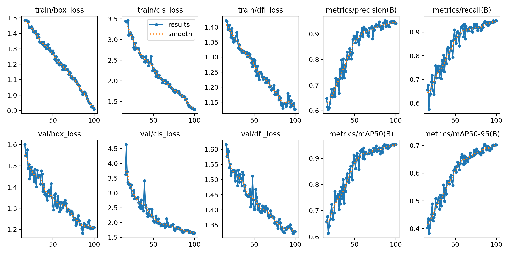

# Retail Object Detection MLOps Assignment

## Overview
This repository shows an end-to-end retail object detection workflow with an emphasis on reproducibility, deployment readiness, and observability.

The core focus is on what was implemented and validated:
- DVC for data and artifact versioning
- ONNX export for efficient, framework-agnostic inference
- FastAPI inference service with prediction logging
- Prometheus + Grafana monitoring for model and service behavior

## Final Model Snapshot
- Dataset classes: 76
- mAP50: 0.919
- Precision: 0.906
- Recall: 0.918
- mAP50-95: 0.68

These results improved significantly after fixing data split quality.

## What Was Built

### 1. Data Versioning with DVC
DVC is used to track large data/model artifacts outside Git while keeping reproducible pointers in the repository.

Why this matters:
- Reproducibility: anyone can pull the exact dataset/model version
- Traceability: model quality can be tied to specific data snapshots
- Collaboration: large files are managed without bloating Git history

Typical workflow:
```bash
# Pull tracked data/artifacts
dvc pull

# (when adding/updating artifacts)
dvc add dataset/
git add dataset.dvc .gitignore
git commit -m "Track dataset with DVC"
```

### 2. Airflow Workflow (Diagram Only)
Airflow orchestrates training/evaluation flow. The README intentionally keeps only the high-level workflow view.



Airflow UI:
- URL: `http://localhost:8080`
- DAG: `branch_dag`



### 3. ONNX Export and Why It Was Used
The trained YOLO model was exported to ONNX (`best.onnx`) and used for serving.

Why ONNX was chosen:
- Smaller, lighter inference stack for deployment
- No PyTorch runtime needed in inference container
- Faster startup and simpler Docker images
- Better portability across runtimes/hardware

Produced artifact:
- `runs/train/pipeline_run/weights/best.onnx`

### 4. FastAPI Inference + Prediction Logging
A FastAPI backend accepts images, runs ONNX inference, and stores prediction metadata in MySQL.

Logged information includes:
- Timestamp
- Inference latency
- Bounding boxes
- Class IDs/names
- Confidence scores
- Optional ground-truth payload

Main endpoints:
- `POST /predict`
- `GET /predictions`
- `GET /predictions/{id}`
- `GET /health`
- `GET /metrics` (Prometheus scrape endpoint)

### 5. Observability with Prometheus + Grafana
Prometheus collects application/inference metrics and Grafana visualizes them.

System-level/API observability:
- Request rate
- Error rate
- P50/P90 request latency
- CPU and memory usage

Model-level observability added:
- Prediction throughput
- Detection throughput by class
- Confidence score behavior
- Inference latency distributions
- Detections per image
- Low-confidence detection trends

This enables monitoring both service health and model quality drift signals.



## Training Curves
The training and validation curves below summarize optimization behavior and final metric convergence.



## Inference and Monitoring Stack
`fastapi-prometheus-grafana-master/` contains:
- `app/`: FastAPI + ONNX Runtime + MySQL logging
- `streamlit/`: simple UI for uploads and results
- `prometheus/`: scrape config
- `grafana/`: dashboard provisioning

## Run (Monitoring Stack)
From `fastapi-prometheus-grafana-master/`:

```bash
docker compose up -d --build
```

Services:
- FastAPI: `http://localhost:8000`
- Streamlit: `http://localhost:8501`
- Prometheus: `http://localhost:9090`
- Grafana: `http://localhost:3000`

## Repository Structure (High Level)
```text
assignment/
|- dags/
|- src/
|- dataset/
|- runs/
|- fastapi-prometheus-grafana-master/
|- docker-compose.yml
|- README.md
```

## Notes
- Large artifacts are expected to be restored via DVC.
- ONNX inference is intentionally used for serving to keep deployment lean.
- Dashboard is oriented toward both API uptime and model behavior, not only infra metrics.
