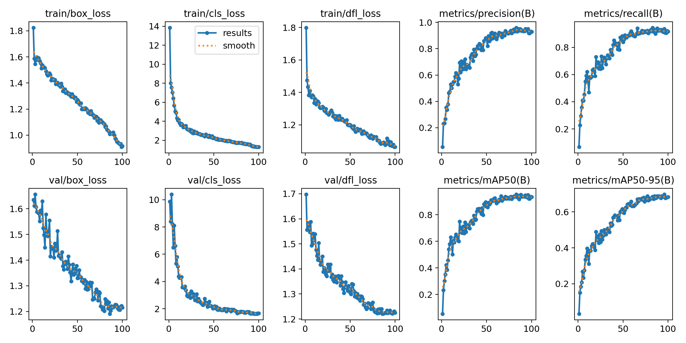
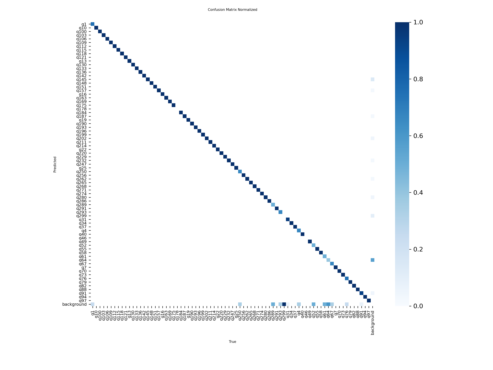
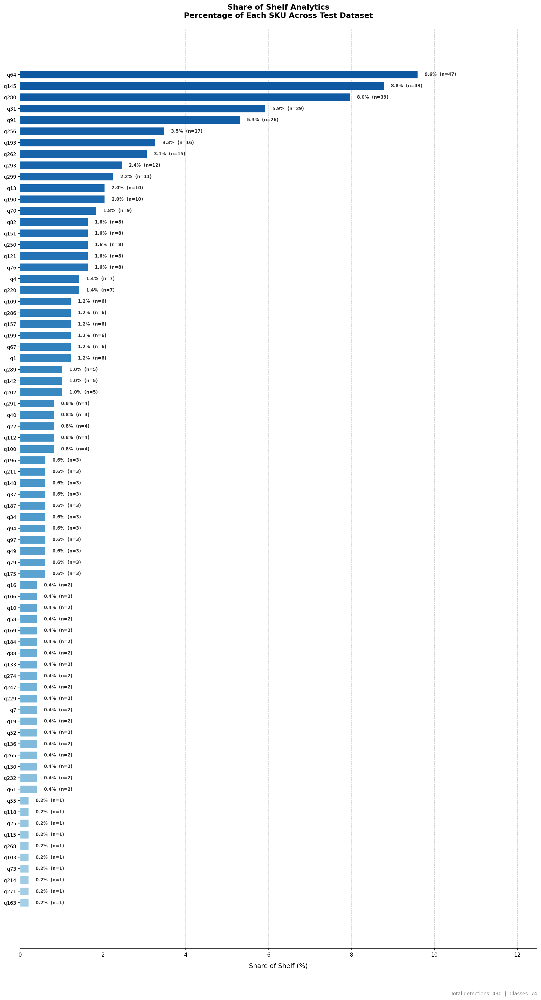

# Retail OS IM  Assignment

## Overview
This project is focused on object detection for retail product classes using YOLOv8 and Weights & Biases (W&B) for experiment tracking. The dataset is highly imbalanced and contains 76 classes. The project demonstrates the impact of proper dataset splitting, experiment tracking, and orchestrated ML pipelines on model performance.
### Technical Report
**(https://docs.google.com/document/d/18CBayr0DgXjQuaPDHvLke60SV4dzWMt4Wb3WaTS6aAA/edit?usp=sharing)**
## Training Results

### Final Model Performance

**Dataset:** 76 Total Classes (Stratified Split)

| Metric | Score |
|--------|-------|
| **mAP50 (Final)** | 0.919 |
| **Precision** | 0.906 |
| **Recall** | 0.918 |
| **mAP50-95** | 0.68 |

**Key Improvement:** Recall has significantly improved from **67%** to **91.8%** after stratified dataset splitting, ensuring better class coverage and balanced training.
**Key Features:**
- Automated ML pipeline using Apache Airflow + Docker
- Intelligent dataset stratification to ensure class coverage
- YOLO11m model training with real-time W&B logging
- Shelf analytics for product share-of-shelf percentages
- Reproducible, containerized environment

---
**How To Run On Google Colab:**
 Click on the link below to run the code on google colab:
**(https://colab.research.google.com/drive/1kQgV7Y1WdnaFq2ovuexW22Cbaxhha4hN?usp=sharing)**

## Architecture: Docker + Apache Airflow

### Why Containerization?
The entire ML pipeline runs inside **Docker containers**, ensuring:
- **Isolation:** All dependencies (PyTorch, YOLO, OpenCV) are isolated from your host system
- **Reproducibility:** Same environment every time, across machines
- **Scalability:** Easy to scale to multiple workers or cloud deployments
- **Orchestration:** Apache Airflow manages task dependencies and retry logic

### System Components

```
┌─────────────────────────────────────┐
│    Docker Compose Services          │
├─────────────────────────────────────┤
│  • PostgreSQL (Airflow metadata)    │
│  • Redis (Message broker)           │
│  • Airflow Scheduler                │
│  • Airflow Webserver (UI)           │
│  • Airflow Worker (Task execution)  │
│  • Airflow API Server               │
└─────────────────────────────────────┘
         ↓
   /opt/airflow/project (mounted volume with all code + data)
```

### The ML Pipeline DAG

The Apache Airflow DAG orchestrates the entire ML workflow. Once the services are running, view the DAG visually at:
**[http://localhost:8080](http://localhost:8080)** → Select `branch_dag` → Click "Graph" tab

**Pipeline Stages:**

1. **check_data_quality** — Analyzes dataset class distribution and imbalance ratio
   - Decides if dataset needs rebuilding based on class coverage and balance

2. **Branch Decision** — Routes to one of two paths:
   - **rebuild_splits** — Performs stratified re-splitting if imbalance > 10× or missing classes
   - **skip_rebuild** — Skips rebuild if data quality is acceptable

3. **Join Gate** — Rejoins both branches using `trigger_rule="none_failed_min_one_success"`

4. **train_model** — YOLO11m training on stratified dataset
   - Logs to W&B with metrics, loss curves, confusion matrix
   - Saves best checkpoint to `runs/train/pipeline_run/weights/best.pt`

5. **evaluate_model** — Validates trained model on stratified validation set
   - Returns precision, recall, mAP50, mAP50-95

6. **run_share_of_shelf** — Shelf analytics on test set
   - Runs predictions on all test images
   - Computes product share-of-shelf percentages (% of each SKU detected)
   - Generates visualizations

7. **push_to_registry** — Placeholder for model registry push (MLflow, W&B, S3, etc.)

---

## Apache Airflow Implementation Details

### DAG Structure

The pipeline is implemented in [`dags/pipeline.py`](dags/pipeline.py) using Airflow's TaskFlow API with dynamic branching:

```
check_data_quality
        ↓
   decide_rebuild (BranchOperator)
    ↙           ↘
rebuild_splits   skip_rebuild
    ↘           ↙
       join (gate)
        ↓
   check_gpu
        ↓
   train_model
        ↓
  evaluate_model
        ↓
 run_share_of_shelf
        ↓
  push_to_registry
```

### Task Implementation

Each task is implemented as a Python function decorated with `@task.python`:

| Task | Function | Description | Key Imports |
|------|----------|-------------|-------------|
| `check_data_quality` | `check_data_quality()` | Analyzes class balance using `diagnose.analyze_dataset()` | `diagnose` |
| `decide_rebuild` | `decide_rebuild()` | Branch operator that routes based on quality results | — |
| `rebuild_splits` | `rebuild_splits()` | Creates stratified train/val/test splits | `rebuild_splits.main` |
| `skip_rebuild` | `skip_rebuild()` | No-op when data quality is acceptable | — |
| `join` | `join()` | Rejoins branches with `trigger_rule="none_failed_min_one_success"` | — |
| `check_gpu` | `check_gpu()` | Logs GPU/CUDA availability before training | `torch` |
| `train_model` | `train_model()` | Trains YOLO11m with W&B logging | `train.run_training` |
| `evaluate_model` | `evaluate_model()` | Evaluates model and returns metrics | `baseline_eval.run_evaluation` |
| `run_share_of_shelf` | `run_share_of_shelf()` | Generates shelf-share analytics | `shelf.run_from_model` |
| `push_to_registry` | `push_to_registry()` | Placeholder for model registry integration | — |

### Configuration

Key configuration values defined in the DAG:

```python
DATASET_YAML        = "/opt/airflow/project/dataset/dataset_stratified/data.yaml"
EXPECTED_CLASSES    = 70
IMBALANCE_THRESHOLD = 10.0
MODEL_BASE          = "/opt/airflow/project/yolo11m.pt"
TRAIN_PROJECT       = "/opt/airflow/project/runs/train"
TRAIN_NAME          = "pipeline_run"
```

### Branching Logic

The `decide_rebuild` task uses Airflow's `@task.branch` decorator to implement conditional execution:

```python
@task.branch
def decide_rebuild(quality_result):
    if quality_result["needs_rebuild"]:
        return "rebuild_splits"
    return "skip_rebuild"
```

This ensures only one path is executed based on data quality analysis.

### Join Gate

After the branch, both paths converge at the `join` task using a special trigger rule:

```python
@task.python(trigger_rule="none_failed_min_one_success")
def join():
    """Rejoin the two branches before training."""
    print("Branch complete — continuing pipeline.")
```

The `none_failed_min_one_success` trigger rule ensures the task runs as long as at least one upstream task succeeded and none failed.

### Docker Integration

#### Custom Dockerfile

The [`Dockerfile`](Dockerfile) extends the official Airflow image with ML dependencies:

```dockerfile
FROM apache/airflow:3.1.6

USER root
RUN apt-get update && apt-get install -y --no-install-recommends \
    libgl1 libglib2.0-0 \
  && rm -rf /var/lib/apt/lists/*
USER airflow

RUN pip install --no-cache-dir --upgrade numpy pandas && \
    pip install --no-cache-dir \
    torch==2.6.0 \
    torchvision==0.21.0 \
    torchaudio==2.6.0 \
    ultralytics==8.4.18 \
    opencv-python-headless==4.13.0.92 \
    pyyaml==6.0.3 \
    pillow==12.1.1 \
    matplotlib==3.10.8 \
    scipy==1.17.1 \
    wandb
```

#### Docker Compose Services

The [`docker-compose.yml`](docker-compose.yml) defines the following services:

| Service | Purpose | Port |
|---------|---------|------|
| `postgres` | Airflow metadata database | 5432 |
| `redis` | Message broker for Celery | 6379 |
| `airflow-apiserver` | REST API server | 8080 |
| `airflow-scheduler` | Schedules and triggers tasks | — |
| `airflow-dag-processor` | Parses and processes DAGs | — |
| `airflow-worker` | Executes tasks (GPU-enabled) | — |
| `airflow-triggerer` | Handles deferred operations | — |
| `airflow-init` | Initializes database and user | — |

**GPU Support:** The worker service is configured with NVIDIA runtime for GPU-accelerated training:

```yaml
airflow-worker:
  runtime: nvidia
  environment:
    NVIDIA_VISIBLE_DEVICES: all
  deploy:
    resources:
      reservations:
        devices:
          - driver: nvidia
            count: all
            capabilities: [gpu]
```

#### Volume Mounts

All project files are mounted into the container:

```yaml
volumes:
  - ${AIRFLOW_PROJ_DIR:-.}/dags:/opt/airflow/dags
  - ${AIRFLOW_PROJ_DIR:-.}/logs:/opt/airflow/logs
  - ${AIRFLOW_PROJ_DIR:-.}/config:/opt/airflow/config
  - ${AIRFLOW_PROJ_DIR:-.}/plugins:/opt/airflow/plugins
  - ${AIRFLOW_PROJ_DIR:-.}:/opt/airflow/project  # Project root
```

The `PYTHONPATH` environment variable is set to `/opt/airflow/project` to allow imports from the project directory.

### Environment Variables

Key environment variables (configured in `.env`):

```bash
AIRFLOW_UID=50000  # User ID for file permissions
```

### Monitoring & Debugging

1. **Web UI:** Access at http://localhost:8080
   - View DAG graph, task states, and execution history
   - Inspect task logs and XCom values

2. **CLI Commands:**
   ```bash
   # View task logs
   docker compose logs airflow-worker
   
   # Check DAG status
   docker compose exec airflow-s airflow dags list
   
   # Trigger DAG via CLI
   docker compose exec airflow-s airflow dags trigger branch_dag
   ```

3. **Health Checks:**
   - Scheduler: http://localhost:8974/health
   - API Server: http://localhost:8080/api/v2/version

---

## Project Structure
```
assignment/
├── dags/                           # Airflow DAG definitions
│   ├── pipeline.py                 # Main ML orchestration DAG
│   └── __pycache__/
├── dataset/                        # Original dataset (images & labels)
│   ├── dataset/                    # Original splits (train, valid, test)
│   └── dataset_stratified/         # After stratduction
├── config/
│   └── airflow.cfg                 # Airflow configuration
├── logs/
│   └── dag_id=branch_dag/          # Airflow task logs
├── plugins/                        # Custom Airflow operators (if any)
├── runs/                           # YOLO training outputs
├── wandb/                          # W&B experiment logs
├── docker-compose.yml              # Docker services definition
├── Dockerfile                      # Custom Airflow image with ML dependencies
├── .env                            # Environment variables
├── requirements.txt                # Python dependencies
├── src/                            # Main Python package
│   ├── model/                      # Training + evaluation
│   ├── data/                       # Data QA + split generation
│   ├── utils/                      # GPU + shelf analytics
│   └── pipeline/dags/              # Canonical DAG implementation
├── README.md                       # This file
└── ...
```

**Key Docker Files:**
- `docker-compose.yml` — Defines all services (Postgres, Redis, Airflow components)
- `Dockerfile` — Extends Apache Airflow image with PyTorch, YOLO, OpenCV, etc.
- `.env` — Environment variables (AIRFLOW_UID, etc.)

---

## Configuration (Runtime + Build-time)

The project now supports centralized configuration through `src.config.get_settings()`.

### Runtime configuration (Python/Airflow tasks)

Precedence (highest to lowest):
1. Environment variables (`APP_*`)
2. YAML file (`APP_CONFIG_FILE`, default: `config/runtime.yaml`)
3. Built-in defaults (`src/config/settings.py`)

Quick start:
```bash
# Optional: create your runtime config
cp config/runtime.yaml.example config/runtime.yaml

# Optional: point to a custom config file
export APP_CONFIG_FILE=config/runtime.yaml
```

Examples:
```bash
APP_TRAIN_EPOCHS=50 APP_USE_WANDB=false python -m src.model.train
APP_DATASET_YAML=dataset/dataset/data.yaml python -m src.data.diagnose
```

### Build-time configuration (Docker image)

Docker build args are sourced from `.env` via `BUILD_*` variables (see `.env.example`):
- `BUILD_AIRFLOW_BASE_IMAGE`
- `BUILD_TORCH_VERSION`, `BUILD_TORCHVISION_VERSION`, `BUILD_TORCHAUDIO_VERSION`
- `BUILD_ULTRALYTICS_VERSION`, `BUILD_OPENCV_HEADLESS_VERSION`, etc.

Then rebuild:
```bash
docker compose build
```

---

## How to Run

### Option 1: Using Apache Airflow (Recommended for Production)

#### Prerequisites
- Docker & Docker Compose installed
- NVIDIA GPU with drivers (optional, for faster training)
- At least 4GB RAM and 10GB disk space

#### Step-by-Step Setup

**1. Clone/navigate to the project:**
```bash
cd assignment
```

**2. Create environment file:**
```bash
# Copy the example environment file
cp .env.example .env          # Linux/Mac
copy .env.example .env        # Windows (Command Prompt)
Copy-Item .env.example .env   # Windows (PowerShell)
```

**3. Set AIRFLOW_UID (Linux only):**
```bash
# On Linux, set AIRFLOW_UID to your current user ID
export AIRFLOW_UID=$(id -u)
# Or edit .env file directly and set AIRFLOW_UID=1000 (or your UID)
```

**4. Build the custom Airflow image:**
```bash
docker compose build
```
This compiles all ML dependencies (PyTorch, YOLO, OpenCV) into the image (~5-10 min).

**5. Start all services:**
```bash
docker compose up -d
```

Wait for all services to be healthy (check with `docker compose ps`).

**6. Access the Airflow Web UI:**
- Open your browser and navigate to: **http://localhost:8080**
- **Login credentials:**
  - **Username:** `airflow`
  - **Password:** `airflow`


**7. Trigger the DAG:**
- After logging in, you'll see the DAG list
- Find `branch_dag` in the list
- Click the "Trigger" button (play icon) on the right
- The DAG will start executing immediately

**8. Monitor execution:**
- Click on `branch_dag` to open the DAG details
- Navigate to the **Graph** tab to see the pipeline visualization
- Click on individual task boxes to view:
  - **Logs** — Real-time task output
  - **XCom** — Data passed between tasks
  - **Rendered Template** — Task configuration

**9. View logs from terminal:**
```bash
# Follow scheduler logs
docker compose logs -f airflow-scheduler

# Follow worker logs (where tasks execute)
docker compose logs -f airflow-worker

# View all logs
docker compose logs -f
```

**10. Stop services:**
```bash
docker compose down
```

**11. Clean up (optional):**
```bash
# Remove all containers, volumes, and networks
docker compose down -v

# Rebuild from scratch
docker compose build --no-cache
docker compose up -d
```

---

### Option 2: Running Individual Functions Locally

If you want to run individual scripts locally without Docker/Airflow:

#### Prerequisites

**1. Install dependencies:**
```bash
pip install -r requirements.txt
```

**2. Set up Weights & Biases:**
```bash
wandb login
```

#### Running Individual Scripts

**1. Analyze Dataset Quality:**
```bash
python -m src.data.diagnose
```
- Analyzes class distribution and imbalance
- Outputs statistics for train/val/test splits

**2. Check Current Splits:**
```bash
python -m src.data.check_splits
```
- Validates split quality
- Reports missing classes per split

**3. Rebuild Stratified Splits:**
```bash
python -m src.data.rebuild_splits
```
- Creates balanced train/val/test splits
- Ensures class coverage across all splits

**4. Train the Model:**
```bash
python -m src.model.train
```
- Trains YOLO11m on stratified dataset
- Logs to W&B automatically
- Saves checkpoint to `runs/train/pipeline_run/weights/best.pt`

**5. Evaluate the Model:**
```bash
python -m src.model.eval
```
- Runs validation on test set
- Returns precision, recall, mAP50, mAP50-95

**6. Run Share-of-Shelf Analytics:**
```bash
python -m src.utils.shelf
```
- Generates product shelf-share percentages
- Creates visualization chart

**7. Check GPU Availability:**
```bash
python -m src.utils.gpu
```
- Verifies CUDA and GPU status
- Shows GPU device name and memory

---

### Option 3: Running Individual Tasks Inside Docker Container

You can also run individual Python functions inside the Airflow container:

**1. Start the container:**
```bash
docker compose up -d
```

**2. Execute a script inside the worker container:**
```bash
# Run diagnose
docker compose exec airflow-worker python -m src.data.diagnose

# Run train
docker compose exec airflow-worker python -m src.model.train

# Run evaluation
docker compose exec airflow-worker python -m src.model.eval

# Run shelf analytics
docker compose exec airflow-worker python -m src.utils.shelf
```

**3. Access the container shell:**
```bash
docker compose exec airflow-worker bash
# Now you're inside the container with all dependencies available
cd /opt/airflow/project
python -m src.data.diagnose
```

---

### Triggering DAG via CLI

Instead of using the web UI, you can trigger the DAG from the command line:

```bash
# Trigger the DAG
docker compose exec airflow-apiserver airflow dags trigger branch_dag

# Check DAG run status
docker compose exec airflow-apiserver airflow dags list-runs --dag-id branch_dag

# View task states for a specific run
docker compose exec airflow-apiserver airflow tasks list --dag-id branch_dag --run-id <RUN_ID>
```

---

### Troubleshooting the Setup

**Services won't start:**
```bash
# Check container status
docker compose ps

# View initialization logs
docker compose logs airflow-init
```

**Permission errors on logs/dags folders:**
```bash
# Fix ownership (Linux)
sudo chown -R $AIRFLOW_UID:0 ./dags ./logs ./plugins ./config
```

**DAG not appearing in UI:**
```bash
# Check DAG processor logs
docker compose logs airflow-dag-processor

# Verify DAG file syntax
docker compose exec airflow-worker python dags/pipeline.py
```

**Worker not picking up tasks:**
```bash
# Restart worker
docker compose restart airflow-worker

# Check worker logs
docker compose logs -f airflow-worker
```

---

## Dataset Issues & Solution
- **Original splits:** Many classes missing from val/test, severe imbalance (see below)
- **After stratified split:** Nearly all classes present in all splits, improved recall

### Example: Class Coverage Before/After
| Split   | Classes Present (Before) | Classes Present (After) |
|---------|-------------------------|-------------------------|
| Train   | 73                      | 76                      |
| Val     | 32                      | 74                      |
| Test    | 29                      | 74                      |

- Classes with <10 train samples remain hard to learn.

---

## Training Results

### Before Stratified Split
- Many classes missing from val/test
- Recall and mAP were much lower

### After Stratified Split
- **Precision:** ↑ 0.93
- **Recall:** ↑ 0.91
- **mAP50:** ↑ 0.94
- **mAP50-95:** ↑ 0.68



---

## Confusion Matrix



---
## Share of Shelf


## Key Pipeline Components

### Scripts & Functions

| Module | Function | Used In |
|--------|----------|---------|
| `src.data.diagnose` | `analyze_dataset(yaml_path)` | check_data_quality task |
| `src.data.rebuild_splits` | `main(base_dir)` | rebuild_splits task |
| `src.model.train` | `run_training(data_yaml, model_base, ...)` | train_model task |
| `src.model.eval` | `run_evaluation(model_path, data_yaml)` | evaluate_model task |
| `src.utils.shelf` | `run_from_model(model_path, test_images, ...)` | run_share_of_shelf task |

### Environment Variables (in `.env`)
```
AIRFLOW_UID=50000  # User ID for file permissions in containers
```

### Volume Mounts (in `docker-compose.yml`)
```
/opt/airflow/project  ← Points to your entire assignment/ directory
                         (allows container to access dataset, models, scripts)
```

---

## Notes & Best Practices

- **The dataset and all outputs are ignored by git** for privacy and size reasons.
- **For best results,** always run `check_data_quality` before training to ensure splits are balanced.
- **GPU Support:** If using NVIDIA GPU, update docker-compose.yml to add `runtime: nvidia` and install nvidia-docker.
- **W&B Integration:** The pipeline logs all training runs to W&B. Ensure you run `wandb login` before training.
  - **Project:** [retail_object-detection](https://wandb.ai/navidkamal-islamic-university-of-technology/retail_object-detection)
  
---

## Troubleshooting

### Docker containers fail to start
```bash
# Clean up and rebuild
docker compose down -v
docker compose build --no-cache
docker compose up -d
```

### Task fails with "No module named 'ultralytics'"
- Ensure `docker compose build` completed successfully
- Check image was built: `docker images | grep assignment`
- Check logs: `docker compose logs airflow-worker`

### Data not found in container
- Verify volume mount: `docker compose exec airflow-scheduler ls /opt/airflow/project`
- Check if data is actually on host at `./dataset/`

### Training is slow in container
- Using CPU instead of GPU? Docker doesn't expose GPU by default.
- Check available resources: `docker stats`

---

## Author
Navid Kamal  
Islamic University of Technology
