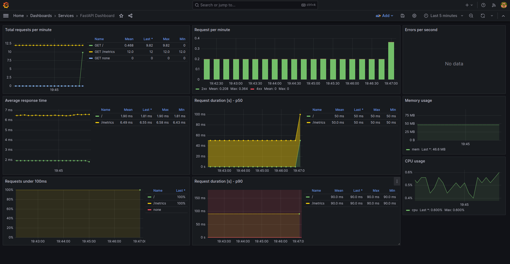

<h1 align="center">Retail Object Detection: FastAPI + Prometheus + Grafana 🎯</h1>

A production-ready microservice for real-time retail object detection with comprehensive monitoring, metrics collection, and data quality tracking. This system leverages FastAPI for high-performance inference, Prometheus for metrics collection, and Grafana for visualization and alerting.

## System Architecture Overview

### Core Components

1. **FastAPI Application** - High-performance REST API for object detection
2. **ONNX Model** - Optimized deep learning model for retail product detection
3. **MySQL Database** - Persistent storage of predictions and detections
4. **Prometheus** - Time-series database for metrics collection
5. **Grafana** - Visualization and monitoring dashboard

## Installation

### Prerequisites

* [Docker](https://docs.docker.com/get-docker/)
* [Docker-compose](https://docs.docker.com/compose/install/)
* Python 3.9+ (for local development)

### Setup

Clone the repository:

```bash
git clone https://github.com/your-repo/fastapi-retail-detection
cd fastapi-retail-detection
```

Install dependencies:

```bash
pip install -r fastapi-prometheus-grafana-master/app/requirements.txt
```

## Usage

### Running with Docker Compose

```bash
docker-compose up -d
```

This starts:
* **FastAPI Application**: http://localhost:8000/
* **Prometheus**: http://localhost:9090/
* **Grafana**: http://localhost:3000/ (default: admin/admin)
* **MySQL Database**: localhost:3306

### API Endpoints

#### 1. Health Check
```bash
GET /health
```
Returns model status and input dimensions.

#### 2. Run Detection
```bash
POST /predict
Content-Type: multipart/form-data

Parameters:
- image: Image file to analyze (required)
- ground_truth: Optional JSON string with ground truth annotations
```

**Response:**
```json
{
  "id": 1,
  "created_at": "2026-03-11T07:55:00",
  "model_name": "best.onnx",
  "inference_ms": 123.45,
  "image_url": "/uploads/image_hash.jpg",
  "annotated_image_url": "/uploads/annotated_image_hash.jpg",
  "ground_truth": null,
  "detections": [
    {
      "class_id": 0,
      "class_name": "class_0",
      "confidence": 0.95,
      "bbox_xyxy": [100, 150, 250, 350]
    }
  ]
}
```

#### 3. List Recent Predictions
```bash
GET /predictions?limit=20
```

#### 4. Get Specific Prediction
```bash
GET /predictions/{prediction_id}
```

#### 5. Access Metrics
```bash
GET /metrics
```
Prometheus format metrics for scraping.

## FastAPI Integration & Usage

### Why FastAPI?

- **High Performance**: Built on Starlette, one of the fastest Python web frameworks
- **Automatic API Documentation**: Swagger UI available at `/docs`
- **Type Safety**: Full Python type hints for request/response validation
- **Async Support**: Handles concurrent requests efficiently
- **Easy Deployment**: Compatible with ASGI servers (Uvicorn, Gunicorn)

### Application Structure

The refactored FastAPI application follows a modular architecture:

```
app/
├── main.py           # FastAPI routes and application initialization
├── config.py         # Configuration management
├── database.py       # SQLAlchemy ORM models
├── schemas.py        # Pydantic response schemas
├── detection.py      # ONNX inference service
├── db_service.py     # Database operations
├── metrics.py        # Prometheus metrics definitions
└── utils.py          # Image processing utilities
```

### Key Features

- **Stateful Model Loading**: Model is loaded once on startup and reused for all requests
- **Async Image Processing**: Non-blocking file uploads and processing
- **Automatic Database Management**: Creates tables and handles connection pooling
- **Error Handling**: Comprehensive validation and error responses

## Prometheus & Metrics for ML Observability

### Collected Metrics

The system tracks 7 key metrics for ML/model monitoring:

#### 1. **ml_predictions_total** (Counter)
- **What it measures**: Total number of predictions made
- **Labels**: `model_name`
- **Use case**: Track overall API usage and throughput

#### 2. **ml_detections_total** (Counter)
- **What it measures**: Total objects detected across all predictions
- **Labels**: `class_name`, `model_name`
- **Use case**: Monitor detection distribution by object class

#### 3. **ml_detection_confidence** (Histogram)
- **What it measures**: Distribution of detection confidence scores
- **Labels**: `class_name`
- **Buckets**: 0.25, 0.35, 0.45, 0.55, 0.65, 0.75, 0.85, 0.95, 1.0
- **Use case**: Understand model uncertainty and prediction quality

#### 4. **ml_inference_duration_ms** (Histogram)
- **What it measures**: Time taken for model inference
- **Labels**: `model_name`
- **Buckets**: 10, 25, 50, 100, 200, 500, 1000, 2000, 5000 ms
- **Use case**: Monitor latency and performance

#### 5. **ml_detections_per_image** (Histogram)
- **What it measures**: Number of objects detected per image
- **Labels**: `model_name`
- **Buckets**: 0, 1, 2, 5, 10, 20, 50, 100
- **Use case**: Understand detection density patterns

#### 6. **ml_avg_confidence** (Gauge)
- **What it measures**: Average confidence score of recent predictions
- **Labels**: `model_name`
- **Use case**: Real-time confidence trend tracking

#### 7. **ml_low_confidence_detections_total** (Counter)
- **What it measures**: Count of detections with confidence < 0.5
- **Labels**: `class_name`, `model_name`
- **Use case**: Alert on low-quality detections

### Accessing Metrics

View metrics in Prometheus format:
```bash
curl http://localhost:8000/metrics
```

Query metrics in Prometheus:
- `ml_predictions_total` - Total predictions
- `rate(ml_predictions_total[5m])` - Predictions per second
- `histogram_quantile(0.95, ml_inference_duration_ms)` - 95th percentile latency

## Grafana Dashboards & Visualization

### Dashboard Overview

<p align="center">
  
</p>

### Key Dashboard Panels

1. **Prediction Stats** - Total predictions and throughput
2. **Model Performance** - Inference latency percentiles (p50, p95, p99)
3. **Confidence Distribution** - Histogram of detection confidence scores by class
4. **Detections per Image** - Average and distribution of objects per image
5. **Low Confidence Alerts** - Real-time count of unreliable detections
6. **Recent Predictions Table** - Latest predictions with timestamps and results

## Data Drift Detection & Monitoring

### What is Data Drift?

Data drift occurs when the statistical properties of input data change over time, causing model performance degradation. In retail detection:

- **Covariate Drift**: New products, packaging changes, shelf layouts
- **Label Drift**: Distribution of object classes changes
- **Prior Drift**: Overall frequency of certain products increases/decreases

### How This System Detects Data Drift

#### 1. **Confidence Score Monitoring**
```
ALERT LowConfidenceDetections
  IF rate(ml_low_confidence_detections_total[5m]) > threshold
  
Detection: When model confidence drops suddenly, it indicates the data may differ from training distribution
Impact: Product packaging changes or new display formats confuse the model
```

#### 2. **Detection Distribution Analysis**
```
ml_detections_per_image over time
```
- **Sudden increase**: New products introduced, shelf density changed
- **Sudden decrease**: Products removed, layout reorganized
- **Gradual change**: Seasonal variation or merchandising strategy shift

#### 3. **Per-Class Confidence Trends**
```
avg(ml_detection_confidence{class_name="class_X"}) over 1h
```
- Identifies which specific product classes are affected
- Helps identify localized issues (e.g., specific brand packaging change)

#### 4. **Inference Latency Changes**
```
rate(ml_inference_duration_ms[5m])
```
- Increased latency may indicate complex new scenes
- Unusual patterns suggest different image characteristics

### Example Drift Scenarios

| Scenario | Metric Change | Detection Method |
|----------|---------------|------------------|
| New product type | ↑ detections_per_image | Hist spike in detection counts |
| Packaging redesign | ↓ confidence score | Confidence drops by class |
| Lighting changes | ↑ inference_time | Latency increase across all classes |
| Seasonal items | ↑ specific class detections | Class-specific counter surge |
| Display reorganization | ↓ detection accuracy | Low-confidence alerts spike |

### Setting Up Drift Alerts

Example Prometheus alert rules:

```yaml
# Alert on confidence drop
- alert: ModelConfidenceDrop
  expr: ml_avg_confidence < 0.7
  for: 10m
  annotations:
    summary: "Model confidence dropped below 70%"

# Alert on unusual detection volume
- alert: AnomalousDetectionRate
  expr: |
    abs(rate(ml_detections_per_image[5m]) - avg_over_time(rate(ml_detections_per_image[5m])[1h:5m])) > threshold
  annotations:
    summary: "Abnormal detection rate detected"

# Alert on performance degradation
- alert: HighLatencyDetected
  expr: histogram_quantile(0.95, ml_inference_duration_ms) > 500
  for: 5m
  annotations:
    summary: "Model inference latency exceeding threshold"
```

### Best Practices for Drift Monitoring

1. **Establish Baselines**: Record normal metrics for your retail environment
2. **Set Meaningful Thresholds**: Calibrate alerts based on business impact
3. **Monitor by Location**: If you have multiple stores, track per-location metrics
4. **Correlate Metrics**: Check if multiple indicators change together
5. **Review Model Performance**: Periodically validate predictions against ground truth
6. **Plan Retraining**: Use drift signals to trigger model retraining workflows

## Integration with ML Workflows

### Data Collection Pipeline
```
Image Upload → Inference → Metrics Recording → Database Storage → Training Data
```

### Retraining Triggers

1. **Performance-Based**: When confidence drops below threshold
2. **Volume-Based**: When detection patterns deviate significantly
3. **Time-Based**: Scheduled monthly/quarterly retraining
4. **Drift-Based**: Automated alerts from Prometheus

### Ground Truth Integration

The `/predict` endpoint accepts optional ground truth annotations. This enables:
- Accuracy calculation during inference
- Creation of labeled training datasets
- Direct comparison with model predictions
- Drift validation against actual distribution changes

## Application Structure

The refactored FastAPI app provides:

- **config.py**: Centralized configuration (DB URL, model path, thresholds)
- **database.py**: SQLAlchemy models for Prediction and Detection persistence
- **detection.py**: ONNX model service with inference logic
- **db_service.py**: Database operations for storing results
- **metrics.py**: Prometheus metric definitions
- **utils.py**: Image preprocessing, postprocessing, NMS, visualization
- **schemas.py**: Pydantic models for API responses

See [REFACTORING.md](REFACTORING.md) for detailed module documentation.

## Monitoring & Troubleshooting

### View Application Logs
```bash
docker-compose logs -f api
```

### Access Prometheus Query Interface
Navigate to http://localhost:9090/graph

### Common Queries

```promql
# Recent prediction rate
rate(ml_predictions_total[5m])

# 95th percentile inference time
histogram_quantile(0.95, rate(ml_inference_duration_ms_bucket[5m]))

# Average confidence by class
avg by (class_name) (ml_avg_confidence)

# Detection volume anomaly
rate(ml_detections_total[5m]) > 100
```

## Performance Benchmarks

- **Inference Latency**: ~100-300ms per image (CPU-based)
- **Throughput**: 3-10 predictions/second (single instance)
- **Memory Usage**: ~2GB for model and dependencies
- **Database**: Handles 1000+ predictions easily

## References

* [Prometheus FastAPI Instrumentator](https://github.com/trallnag/prometheus-fastapi-instrumentator)
* [FastAPI Official Documentation](https://fastapi.tiangolo.com/)
* [Prometheus Best Practices](https://prometheus.io/docs/practices/instrumentation/)
* [Grafana Dashboard Best Practices](https://grafana.com/docs/grafana/latest/dashboards/)
* [Data Drift in Machine Learning](https://towardsdatascience.com/data-drift-detection-in-machine-learning-models-e17e1b1e24ba)
